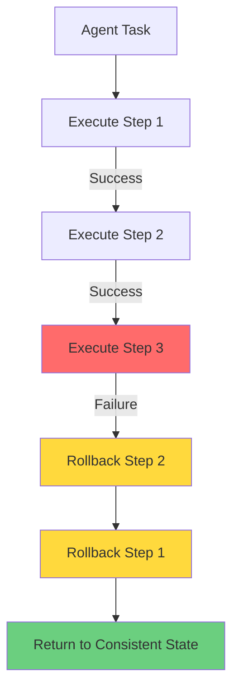

[](https://freepalestine.dev)

# AgentHelm

[](https://pypi.org/project/agenthelm/)
[](https://github.com/hadywalied/agenthelm/actions/workflows/ci.yml)
[](https://github.com/hadywalied/agenthelm/blob/main/LICENSE)

**The AI Agent Framework That Doesn't Break Your Business**

---

## The Problem

Your AI agent just charged a customer \$10,000 instead of \$100.  
Or deleted production data.  
Or sent 5,000 emails to the wrong list.

When you frantically check the logs, you find:

- ❌ No clear record of which LLM call made the decision
- ❌ No way to undo the damage automatically
- ❌ No approval gate that could have prevented it
- ❌ Hours of manual rollback ahead of you

**Most agent frameworks are built for demos. AgentHelm is built for production.**

---

## The Solution: Transactional Agent Workflows

AgentHelm brings **database-style safety guarantees** to AI agents. When something goes wrong, the entire workflow
automatically rolls back—just like a database transaction.

```python
@tool(compensating_tool=reverse_refund)
def process_refund(order_id: str, amount: float):
    """Issue a refund to the customer"""
    # If this fails or times out, reverse_refund runs automatically
    return charge_api.refund(order_id, amount)


@tool()
def reverse_refund(order_id: str, amount: float):
    """Compensating action - called automatically on failure"""
    return charge_api.charge(order_id, amount)
```

**If step 3 fails, steps 2 and 1 are automatically undone.** No manual cleanup. No inconsistent state. No 3 AM
emergencies.

---

## Why Teams Choose AgentHelm

### 🔒 **Transactional Safety**

- **Automatic rollbacks**: Failed workflows reverse all completed steps
- **Compensating actions**: Define rollback logic for every risky operation
- **ACID-like guarantees**: Workflows either complete fully or roll back completely
- **No broken state**: Your systems stay consistent even when agents fail

### 🛡️ **Human-in-the-Loop**

```python
@tool(requires_approval=True)
def charge_credit_card(amount: float, card_id: str):
    """High-value operations require human approval"""
    return payment_api.charge(amount, card_id)
```

- Single decorator to gate dangerous operations
- CLI approval prompts with full context
- Async approval workflows for team review
- Audit trail of who approved what

### 🔍 **Forensic-Grade Observability**
```bash
# Your agent failed. Find out why in 60 seconds:
agenthelm traces show <trace_id>

# See every LLM call, tool execution, timing, and cost
# Filter by status, tool name, date, execution time
agenthelm traces filter --status failed --tool-name process_refund

# Export for compliance/analysis
agenthelm traces export --format csv --output incident_report.csv
```

- **Structured traces**: Every decision, tool call, input, output, error, and timing
- **SQL-powered analysis**: Query traces like a database (SQLite storage)
- **Cost tracking**: Know exactly what each run cost you in API tokens
- **ReAct reasoning capture**: See the LLM's internal "thinking" at each step

### ⚡ **Production-Ready Resilience**

- **Automatic retries**: Configure retry policies per tool
- **Timeout protection**: Set execution limits to prevent runaway agents
- **Backoff strategies**: Exponential backoff for rate-limited APIs
- **Graceful degradation**: Continue workflow when non-critical tools fail

---

## Quick Start

### Installation
```bash
pip install agenthelm
```

### 1. Define Your Tools with Rollback Logic

```python
from agenthelm import tool


@tool(compensating_tool=cancel_booking)
def book_hotel(hotel_id: str, dates: dict) -> dict:
    """Books a hotel room"""
    return hotel_api.book(hotel_id, dates)

@tool()
def cancel_booking(hotel_id: str, dates: dict) -> dict:
    """Rollback action for book_hotel"""
    return hotel_api.cancel(hotel_id, dates)


@tool(requires_approval=True, compensating_tool=reverse_charge)
def charge_customer(amount: float, customer_id: str) -> dict:
    """Charge customer - requires approval if amount > $100"""
    return payment_api.charge(amount, customer_id)


@tool()
def reverse_charge(amount: float, customer_id: str) -> dict:
    """Rollback action for charge_customer"""
    return payment_api.refund(amount, customer_id)
```

### 2. Configure Your LLM

```bash
# For Mistral
export MISTRAL_API_KEY="your_key_here"
export MISTRAL_MODEL_NAME="mistral-small-latest"  # Optional

# For OpenAI
export OPENAI_API_KEY="your_key_here"
export OPENAI_MODEL_NAME="gpt-4"  # Optional
```

### 3. Run Your Agent

```bash
agenthelm run \
  --agent-file my_agent.py \
  --task "Book a hotel for Dec 25-27 and charge the customer" \
  --trace-file bookings.db
```

**What happens:**

1. Agent books hotel ✓
2. Agent attempts to charge customer
3. You review and approve the charge
4. Charge succeeds ✓
5. **OR** Charge fails → hotel booking automatically cancels ↩️

### 4. Analyze Execution

```bash
# List all traces
agenthelm traces list --trace-file bookings.db

# Show full trace with reasoning
agenthelm traces show 0 --trace-file bookings.db

# Find failures
agenthelm traces filter --status failed --trace-file bookings.db

# Export for analysis
agenthelm traces export --output report.csv --format csv
```

---

## Real-World Example: Customer Refund Agent

**Scenario**: Process customer refunds with automatic validation, approval workflows, and guaranteed rollback if
anything fails.

```python
from agenthelm import tool


# Step 1: Verify order
@tool(compensating_tool=log_verification_failure)
def verify_order(order_id: str) -> dict:
    """Verifies order exists and is refundable"""
    return orders_api.verify(order_id)


# Step 2: Process refund with approval
@tool(
    requires_approval=True,  # Manager must approve refunds > $100
    compensating_tool=reverse_refund
)
def process_refund(order_id: str, amount: float) -> dict:
    """Issues refund to customer"""
    return payments_api.refund(order_id, amount)


@tool()
def reverse_refund(order_id: str, amount: float) -> dict:
    """Rollback: re-charge customer if refund needs to be reversed"""
    return payments_api.charge(order_id, amount)


# Step 3: Notify customer
@tool(compensating_tool=send_correction_email)
def send_refund_email(customer_email: str, amount: float) -> dict:
    """Sends confirmation email"""
    return email_api.send(customer_email, f"Refund of ${amount} processed")


@tool()
def send_correction_email(customer_email: str, amount: float) -> dict:
    """Rollback: notify customer that refund was reversed"""
    return email_api.send(customer_email, f"Refund of ${amount} reversed due to error")
```

**Run it:**

```bash
agenthelm run \
  --agent-file refund_agent.py \
  --task "Process refund for order #12345, customer complained product arrived damaged" \
  --trace-file refunds.db
```

**What AgentHelm guarantees:**

- ✅ If verification fails → nothing happens (no partial state)
- ✅ If refund is >$100 → blocks for approval before executing
- ✅ If refund API fails → no email sent (atomic operation)
- ✅ If email fails → refund reversed, customer re-charged, state consistent
- ✅ Every decision logged with full context for compliance audit

**Full example code**: [
`examples/customer_refund_agent/refund_agent.py`](examples/customer_refund_agent/refund_agent.py)

---

## Architecture: How It Works

AgentHelm implements a **compensating transaction pattern** (also called the Saga pattern) for AI agents:



### Key Components

1. **Orchestrator**: Manages workflow execution and rollback coordination
2. **Tracer**: Captures every action for observability and replay
3. **Storage Backend**: JSON (development) or SQLite (production) trace storage
4. **Approval Handler**: Human-in-the-loop gates for sensitive operations
5. **Compensation Engine**: Executes rollback actions in reverse order on failure

---

## Observability Deep Dive

### Storage Backends

**JSON Storage** (for development):

```bash
agenthelm run --agent-file agent.py --trace-file trace.json
```

- Simple file-based storage
- Human-readable format
- Best for local development

**SQLite Storage** (for production):

```bash
agenthelm run --agent-file agent.py --trace-file production.db
```

- Relational database with indexes
- Efficient querying and filtering
- Handles thousands of traces
- Concurrent access support

### Trace Analysis Commands

**List traces**:

```bash
# Show last 10 traces
agenthelm traces list --limit 10

# Pagination
agenthelm traces list --limit 20 --offset 40

# JSON output for programmatic access
agenthelm traces list --json
```

**Show detailed trace**:

```bash
# See every LLM call, tool execution, timing
agenthelm traces show <trace_id>

# Includes:
# - Full prompt and completion
# - Tool calls with inputs/outputs
# - Execution times and costs
# - Error messages and stack traces
# - Agent's reasoning at each step
```

**Filter traces**:

```bash
# Find failed executions
agenthelm traces filter --status failed

# Find slow operations
agenthelm traces filter --min-time 5.0

# Find specific tool usage
agenthelm traces filter --tool-name process_refund

# Combine filters
agenthelm traces filter \
  --status failed \
  --date-from 2025-11-01 \
  --tool-name charge_customer
```

**Export traces**:

```bash
# Generate incident report
agenthelm traces export --output report.csv --format csv --status failed

# Export all data
agenthelm traces export --output backup.json --format json

# Generate summary
agenthelm traces export --output summary.md --format md
```

---

## Advanced Features

### Retry Policies

```python
@tool(max_retries=3, retry_delay=1.0, backoff_factor=2.0)
def flaky_api_call(data: dict) -> dict:
    """Retries on transient failures with exponential backoff"""
    return external_api.post(data)
```

### Conditional Compensation

```python
@tool(compensating_tool=rollback_payment)
def process_payment(amount: float) -> dict:
    result = payment_api.charge(amount)
    # Store metadata for compensation
    result['compensation_data'] = {'amount': amount, 'timestamp': time.time()}
    return result


@tool()
def rollback_payment(amount: float, compensation_data: dict) -> dict:
    """Uses stored metadata for precise rollback"""
    return payment_api.refund(
        amount=compensation_data['amount'],
        timestamp=compensation_data['timestamp']
    )
```

### Multi-Step Workflow Safety

```python
# Complex workflow with multiple compensation paths
workflow = [
    reserve_inventory,  # Compensate: release_inventory
    charge_customer,  # Compensate: refund_customer  
    schedule_shipping,  # Compensate: cancel_shipping
    send_confirmation,  # Compensate: send_cancellation
]

# If schedule_shipping fails:
# 1. Compensate: cancel_shipping (no-op, never executed)
# 2. Compensate: refund_customer 
# 3. Compensate: release_inventory
# Result: System returns to initial state
```

---

## Use Cases

### ✅ Financial Operations

- Payment processing with guaranteed rollback
- Multi-step transactions (reserve → charge → fulfill)
- Regulatory compliance with full audit trails

### ✅ E-commerce Automation

- Order fulfillment workflows
- Inventory management with conflict resolution
- Customer service automation (refunds, replacements)

### ✅ DevOps & Infrastructure

- Multi-cloud provisioning with cleanup guarantees
- Database migrations with rollback
- Deployment pipelines with automatic revert

### ✅ Data Processing

- ETL pipelines with transactional guarantees
- Multi-step data transformations
- API orchestration with retry and rollback

---

## Comparison: AgentHelm vs Others

| Feature                  | AgentHelm         | LangChain           | AutoGPT        | CrewAI               |
|--------------------------|-------------------|---------------------|----------------|----------------------|
| **Automatic Rollback**   | ✅ Built-in        | ❌ Manual            | ❌ None         | ❌ None               |
| **Transactional Safety** | ✅ ACID-like       | ❌ No                | ❌ No           | ❌ No                 |
| **Human Approval**       | ✅ One decorator   | ⚠️ Custom code      | ❌ No           | ❌ No                 |
| **SQL-powered Traces**   | ✅ SQLite built-in | ⚠️ LangSmith (paid) | ❌ File logs    | ❌ Basic logs         |
| **Reasoning Capture**    | ✅ ReAct traces    | ⚠️ Verbose          | ⚠️ Limited     | ⚠️ Limited           |
| **Production Focus**     | ✅✅✅               | ⚠️ Research-first   | ❌ Experimental | ⚠️ Multi-agent demos |

[//]: # (| **Cost Tracking** | ✅ Per-trace | ⚠️ Manual | ❌ No | ❌ No |)

**AgentHelm is not the most feature-rich framework. It's the framework designed to prevent 3 AM production incidents.**

---

## Documentation

📚 **Full Documentation**: [https://hadywalied.github.io/agenthelm/](https://hadywalied.github.io/agenthelm/)

Includes:

- Complete API reference
- Step-by-step tutorials
- Real-world examples
- Best practices for production deployment

---

## Roadmap

**v0.3.0 - Plan-Driven Execution** (In Development)

- [ ] Formal plan schemas with validation
- [ ] LLM-backed planner for multi-step tasks
- [ ] Plan approval workflow (review before execution)
- [ ] DAG-based execution for parallel steps
- [ ] Enhanced budget enforcement (tokens, time, I/O)
- [ ] Expanded LLM support (Anthropic Claude, Google Gemini)

**Future**

- [ ] Web-based dashboard for trace visualization
- [ ] Multi-agent coordination with conflict resolution
- [ ] Policy engine for complex constraints
- [ ] Webhook support for external integrations

---

## Contributing

We welcome contributions! Whether it's:

- 🐛 Bug reports
- 💡 Feature requests
- 📖 Documentation improvements
- 🔧 Code contributions

Please see our [Contributing Guidelines](CONTRIBUTING.md) for more details.

**Please open an issue or submit a pull request.**

If you're deploying agents in production, we especially want to hear about your challenges. What's missing? What broke?
What would make AgentHelm more useful?

---

## Community & Support

- **GitHub Issues**: [github.com/hadywalied/agenthelm/issues](https://github.com/hadywalied/agenthelm/issues)
- **GitHub Discussions
  **: [github.com/hadywalied/agenthelm/discussions](https://github.com/hadywalied/agenthelm/discussions)
- **Documentation**: [hadywalied.github.io/agenthelm](https://hadywalied.github.io/agenthelm/)
- **Author**: [Hady Walied](https://github.com/hadywalied) | [LinkedIn](https://www.linkedin.com/in/hadywalied/)

---

## License

MIT License - see [LICENSE](LICENSE) file for details.

---

## Who Is AgentHelm For?

**✅ You need AgentHelm if:**

- You're deploying agents that interact with real systems (payments, databases, APIs)
- You need audit trails for compliance or debugging
- You want transactional guarantees (all-or-nothing execution)
- You've been burned by agents making irreversible mistakes
- You need to show non-technical stakeholders what the agent did

**❌ You don't need AgentHelm if:**

- You're building toy demos or proof-of-concepts
- Your agents only read data (never write/modify)
- You're doing research on agent architectures
- You want maximum flexibility over production safety

---

**AgentHelm: Build AI agents your CTO will approve.**

⭐ **Star us on GitHub if this solves a problem you're facing.**  
🐛 **Try it and tell us what breaks.**  
💬 **Share your production agent challenges, we're listening.**