# 🚀 AgentHelm v0.3.0 — DSPy Multi-Agent Orchestration

> **Project**: AgentHelm
> **Version**: v0.3.0 (DSPy + Multi-Agent Rewrite)
> **Status**: PRD
> **Branch**: `v0.3.0-dspy-multiagent`
> **Created**: December 2025

---

## 1. Executive Summary

**AgentHelm v0.3.0** evolves the framework into a full **DSPy-native multi-agent orchestration system**, designed for **stateless agents** that communicate through a **unified memory layer** and inter-agent protocols (**MCP**, **A2A**).

This version preserves AgentHelm's proven patterns (tool contracts, rollback, tracing) while adding:
- **DSPy-native agents** — Agents as DSPy Modules with Signatures
- **Unified memory layer** — Short-term + semantic memory accessible by all agents
- **Protocol-native communication** — MCP and A2A support for agent interoperability
- **Full observability** — every interaction is traced and reproducible

---

## 2. Problem Statement

### Current Landscape Gaps

| Framework | Issue |
|-----------|-------|
| **LangGraph** | Graph-centric, complex for simple use cases |
| **CrewAI** | Stateful agents, tight coupling, limited protocol support |
| **AutoGen** | Microsoft-specific patterns, conversation-centric |
| **DSPy (standalone)** | No multi-agent coordination primitives |
| **MCP** | Protocol only, no orchestration layer |

### The Opportunity

Build a framework that:
1. Makes **DSPy** the first-class citizen for agent logic
2. Treats **memory as infrastructure** (like a database), not agent state
3. Speaks **open protocols** (MCP, A2A) for interoperability
4. Optimizes itself over time via DSPy's optimizers

---

## 3. Target Users

| Persona | Use Case |
|---------|----------|
| **AI Engineers** | Build production multi-agent systems |
| **Researchers** | Experiment with agent coordination patterns |
| **DevOps/MLOps** | Deploy and monitor agent workflows |
| **Tool Builders** | Expose capabilities via MCP servers |

---

## 4. Core Principles

1. **Agents are Stateless Functions**
   - No internal memory; all context comes from the Memory Hub
   - Enables horizontal scaling and fault tolerance

2. **Memory is Shared Infrastructure**
   - Unified Memory Hub accessible by all agents
   - Supports multiple backends (Redis, PostgreSQL, Vector DBs)

3. **Protocol-First Communication**
   - MCP for tool/context sharing
   - A2A for agent-to-agent messaging
   - Extensible for future protocols

4. **DSPy-Native Design**
   - Agents defined as DSPy Modules with Signatures
   - Automatic prompt optimization via DSPy optimizers

5. **Observable by Default**
   - Every agent call, memory access, and message is traced
   - OpenTelemetry integration for production monitoring

6. **Plan-Driven Execution**
   - PlannerAgent generates structured execution plans
   - Plans have sequential and parallel steps with agent assignments
   - User reviews and approves plans before execution
   - Support for user-defined custom plans (YAML)

---

## 5. AgentHelm DNA — Proven Patterns Carried Forward

> *These patterns from AgentHelm are battle-tested and will be core to the new framework.*

### 5.1 Tool Contracts

Every tool is registered with a **declarative contract** that specifies:

```python
@tool(
    inputs={"file_path": "str"},           # Expected inputs
    outputs={"content": "str"},            # Expected outputs
    side_effects=["file:read"],            # What the tool affects
    max_cost=0.01,                         # Cost budget for the operation
    requires_approval=True,                # Human-in-the-loop gate
    retries=3,                             # Automatic retry on failure
    compensating_tool="delete_file",       # Rollback action if downstream fails
)
def read_file(file_path: str) -> str:
    ...
```

**Benefits:**
- **Introspection**: Agents can discover tool capabilities at runtime
- **Safety**: Approval gates for dangerous operations
- **Resilience**: Built-in retry logic with configurable attempts
- **Rollback**: Compensating actions for transactional workflows

### 5.2 Compensating Actions (Saga Pattern / Rollback)

When a multi-step workflow fails, the framework automatically executes **compensating tools** in reverse order:

```
Step 1: create_file("data.txt")     ✅ Success
Step 2: write_data("data.txt", ...) ✅ Success  
Step 3: send_email(...)             ❌ FAILED

--- ROLLBACK INITIATED ---
Compensate Step 2: (no compensating tool)
Compensate Step 1: delete_file("data.txt") ✅ Executed
--- ROLLBACK COMPLETE ---
```

This implements the **Saga Pattern** for distributed transactions in agent workflows.

### 5.3 Execution Tracer with LLM Reasoning

Every tool execution is traced with rich metadata:

```python
class ExecutionEvent(BaseModel):
    timestamp: datetime
    tool_name: str
    inputs: dict[str, Any]
    outputs: dict[str, Any]
    execution_time: float
    error_state: Optional[str]
    
    # LLM Context (from AgentHelm)
    llm_reasoning_trace: str      # Why the agent chose this action
    confidence_score: float       # Agent's confidence (0.0 - 1.0)
    
    # Cost Tracking (new)
    token_usage: TokenUsage       # Input/output tokens
    estimated_cost_usd: float     # LLM API cost
```

**Storage Backends:**
- JSON files (development)
- SQLite (single-machine)
- PostgreSQL (production)

### 5.4 Cost Tracking & Budgets

Every LLM call tracks token usage and estimated cost:

```python
class TokenUsage(BaseModel):
    input_tokens: int
    output_tokens: int
    model: str

class CostTracker:
    def track(self, usage: TokenUsage) -> float:
        """Calculate cost based on model pricing."""
        ...
    
    def check_budget(self, max_cost: float) -> bool:
        """Enforce cost limits before execution."""
        ...
```

**Budget Enforcement:**
- Per-tool cost limits (`max_cost` in contract)
- Per-session total budget
- Per-agent budget allocation

### 5.5 Approval Handlers (Human-in-the-Loop)

For dangerous operations, require explicit approval:

```python
class ApprovalHandler(ABC):
    @abstractmethod
    def request_approval(self, tool_name: str, arguments: dict) -> bool:
        """Request user approval before execution."""
        ...

class CliHandler(ApprovalHandler):
    """Interactive CLI approval."""
    ...

class WebhookHandler(ApprovalHandler):
    """Approval via external webhook (Slack, Teams, etc.)."""
    ...

class AutoApproveHandler(ApprovalHandler):
    """Auto-approve for CI/testing."""
    ...
```

---

## 6. Architecture Overview

```mermaid
graph TB
    subgraph Runtime["AgentHelm v0.3.0 Runtime"]
        subgraph Agents["DSPy Agents"]
            A1[Agent A<br/>DSPy Module]
            A2[Agent B<br/>DSPy Module]
            A3[Agent C<br/>DSPy Module]
        end
        
        subgraph Router["Protocol Router"]
            MCP[MCP Handler]
            A2A[A2A Handler]
            HTTP[HTTP/WS API]
        end
        
        subgraph Memory["Memory Hub"]
            ST[Short-Term<br/>Redis]
            LT[Long-Term<br/>PostgreSQL]
            SEM[Semantic<br/>Qdrant]
            SS[Shared State]
        end
        
        subgraph Tools["Tool Registry"]
            T1[MCP Servers]
            T2[Local Tools]
            T3[Remote APIs]
        end
        
        A1 --> Router
        A2 --> Router
        A3 --> Router
        Router --> Memory
        Memory --> Tools
    end
    
    style Runtime fill:#1a1a2e,stroke:#16213e
    style Agents fill:#0f3460,stroke:#e94560
    style Router fill:#533483,stroke:#e94560
    style Memory fill:#0f3460,stroke:#e94560
    style Tools fill:#533483,stroke:#e94560
```



---

## 6. Core Components

### 6.1 Agent System (DSPy-Native)

```python
import dspy
from agenthelm import Agent, MemoryContext

class ResearcherSignature(dspy.Signature):
    """Research a topic and return findings."""
    topic: str = dspy.InputField(desc="Topic to research")
    context: MemoryContext = dspy.InputField(desc="Shared memory context")
    
    findings: str = dspy.OutputField(desc="Research findings")
    sources: list[str] = dspy.OutputField(desc="Source URLs")

class ResearcherAgent(Agent):
    def __init__(self):
        super().__init__(name="researcher")
        self.research = dspy.ChainOfThought(ResearcherSignature)
    
    def forward(self, topic: str, context: MemoryContext):
        result = self.research(topic=topic, context=context)
        # Write findings to shared memory
        context.memory.write("research_findings", result.findings)
        return result
```

### 6.2 Memory Hub

| Memory Type | Purpose | Backend |
|-------------|---------|---------|
| **Short-Term** | Current session context | Redis |
| **Long-Term** | Persistent facts/learnings | PostgreSQL, SQLite |
| **Semantic** | Vector similarity search | **Qdrant** (Rust-based, fast) |
| **Shared State** | Cross-agent coordination | Redis |

> **Why Qdrant?** Qdrant is written in Rust 🦀 and offers superior performance at scale compared to Python-based alternatives like ChromaDB. It also supports advanced filtering, distributed deployment, and has excellent production readiness.

```python
from agenthelm.memory import MemoryHub, ShortTermMemory, SemanticMemory

hub = MemoryHub(
    short_term=ShortTermMemory(backend="redis://localhost:6379"),
    semantic=SemanticMemory(backend="qdrant://localhost:6333"),  # Qdrant!
)

# Agents read/write via context
context = hub.create_context(session_id="task-123")
context.write("user_goal", "Plan a trip to Japan")

# Semantic search with filtering
results = context.search_semantic(
    query="travel preferences",
    top_k=5,
    filter={"agent": "researcher"}  # Qdrant advanced filtering
)
```

### 6.3 Protocol Router

#### MCP (Model Context Protocol)
- Expose Nexus tools to external AI systems (Claude, Gemini, etc.)
- Consume external MCP servers as tools for Nexus agents

#### A2A (Agent-to-Agent)
- Standard messaging between agents (request/response, async events)
- Inter-process and inter-machine agent communication

```python
from agenthelm.protocols import MCPServer, A2AClient

# Expose AgentHelm agent as MCP tool
mcp = MCPServer(agents=[researcher_agent, writer_agent])
mcp.serve(port=8080)

# Call external A2A agent
a2a = A2AClient("https://external-agent.example.com")
response = await a2a.send_task(task="Summarize this document", data={...})
```

### 6.4 Orchestration Patterns

| Pattern | Description |
|---------|-------------|
| **Sequential** | Agents run in order (A → B → C) |
| **Parallel** | Agents run concurrently, results merged |
| **Hierarchical** | Manager agent delegates to worker agents |
| **Reactive** | Agents respond to events/messages |
| **DAG** | Directed acyclic graph of dependencies |

```python
from agenthelm.orchestration import Pipeline, Parallel, Manager

# Sequential pipeline
pipeline = Pipeline([
    ResearcherAgent(),
    AnalyzerAgent(),
    WriterAgent(),
])

# Parallel execution
parallel = Parallel([
    WebSearchAgent(),
    DatabaseQueryAgent(),
    FileReaderAgent(),
])

# Hierarchical with manager
manager = Manager(
    coordinator=CoordinatorAgent(),
    workers=[ResearcherAgent(), WriterAgent(), ReviewerAgent()],
)
```

### 6.5 Observability

- **Tracing**: OpenTelemetry integration for distributed tracing
- **Logging**: Structured JSONL logs for all events
- **Metrics**: Agent latency, memory operations, token usage
- **Artifacts**: Store plans, outputs, diffs for reproducibility

---

## 7. Feature Roadmap

### Phase 1: Foundation (v0.1.0) — 4-6 weeks
- [ ] Core agent abstraction over DSPy
- [ ] Memory Hub with short-term and semantic memory
- [ ] Basic orchestration (Sequential, Parallel)
- [ ] CLI for running agents
- [ ] OpenTelemetry tracing

### Phase 2: Protocols (v0.2.0) — 4-6 weeks
- [ ] MCP server implementation (expose agents as tools)
- [ ] MCP client (consume external MCP servers)
- [ ] A2A protocol implementation
- [ ] Inter-agent messaging primitives

### Phase 3: Advanced Orchestration (v0.3.0) — 4-6 weeks
- [ ] Hierarchical (Manager/Worker) pattern
- [ ] DAG-based execution
- [ ] Reactive/event-driven agents
- [ ] DSPy optimizer integration for auto-tuning

### Phase 4: Production Readiness (v1.0.0) — 6-8 weeks
- [ ] Persistent memory backends (PostgreSQL, Redis)
- [ ] Authentication and authorization
- [ ] Rate limiting and budgets
- [ ] Deployment guides (Docker, K8s)
- [ ] Comprehensive documentation

---

## 8. Technical Decisions

| Decision | Choice | Rationale |
|----------|--------|-----------|
| **LLM Abstraction** | DSPy 3.0+ | Programmatic prompts, optimizers, multi-model |
| **Primary Language** | Python 3.11+ | DSPy, ML ecosystem, async support |
| **Memory (Short-Term)** | Redis | Speed, pub/sub, TTL support |
| **Memory (Semantic)** | **Qdrant** | Rust-based, faster than ChromaDB, production-ready |
| **Tracing** | OpenTelemetry | Industry standard, vendor-agnostic |
| **Protocol Serialization** | JSON-RPC | MCP/A2A compatible |
| **Package Manager** | uv | Fast, modern Python packaging |
| **Testing** | pytest + hypothesis | Property-based testing for agents |

---

## 9. Success Metrics

| Metric | Target (v1.0) |
|--------|---------------|
| **Agent Definition Lines** | <50 lines for a typical agent |
| **Memory Latency (p99)** | <10ms for short-term, <100ms for semantic |
| **Multi-Agent Coordination** | Support 10+ agents in a single workflow |
| **Protocol Compliance** | 100% MCP spec, 100% A2A spec |
| **Test Coverage** | >80% |

---

## 10. Risks and Mitigations

| Risk | Mitigation |
|------|------------|
| **DSPy API instability** | Pin versions, abstract where needed |
| **MCP/A2A spec changes** | Modular protocol handlers, version negotiation |
| **Memory backend complexity** | Start with Qdrant Docker, add Redis for short-term |
| **Scope creep** | Strict phase gating, MVP mindset |

---

## 11. Open Questions

1. ~~**Naming**~~: ✅ Keeping **AgentHelm**
2. **Licensing**: MIT? Apache 2.0? (currently MIT)
3. **Mono-repo or Multi-repo?**: Core + memory + protocols as separate packages?
4. **Cloud-first or Local-first?**: Design for single-machine first, or distributed from day one?

---

## 12. Next Steps

1. **Finalize PRD**: Address open questions, get stakeholder buy-in
2. **Create repository**: Set up project structure, CI/CD
3. **Phase 1 Kickoff**: Implement core agent + memory + basic orchestration
4. **Weekly milestones**: Demo progress every week

---

*This PRD is a living document. Last updated: December 2025*
